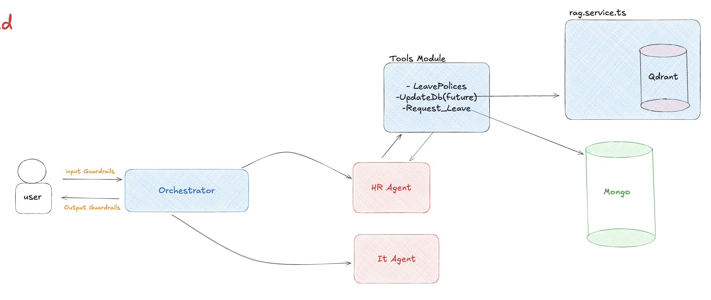

## Installation

1. **Clone the repository**

   ```bash
   git clone https://github.com/your-username/Multi-Agentic-System.git
   cd Multi-Agentic-System
   ```

2. **Install dependencies**

   ```bash
   npm install
   ```

3. **Configure environment variables**

   Create a `.env` file in the project root and add the following:

   ```env
   OPENAI_API_KEY={your open ai api key}
   QDRANT_URL={your qdrant cloud db url}
   QDRANT_API_KEY={qdrant api key}
   QDRANT_COLLECTION_NAME=policy_documents
   MONGODB_URI={your mongodb cluster url}
   ```

4. **Build the application**

   ```bash
   npm run build
   ```

5. **Start the agent**
   ```bash
   npm start
   ```
6. **Run with Docker**

```bash
# Build and run the application
docker-compose run --rm app
```

---

## Architecture Diagram


